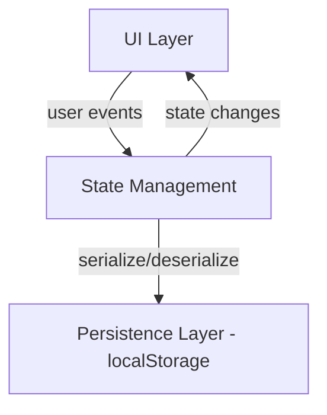
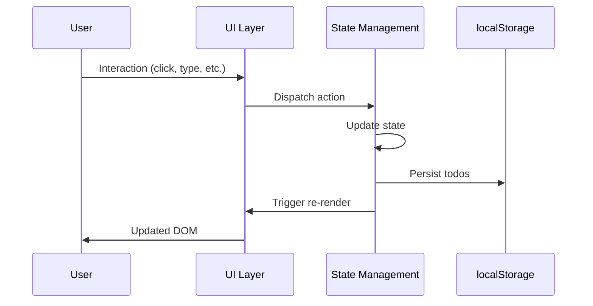
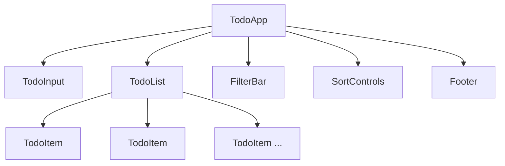

# Design Document

## Overview

A client-side single-page todo list application built with HTML, CSS, and vanilla JavaScript. The app allows users to create, display, complete, edit, and delete todo items. It supports filtering by status and priority, sorting by deadline and priority, deadline tracking with overdue highlighting, and color-coded priority indicators. All state is persisted to browser `localStorage` so tasks survive page reloads.

No frameworks or build tools are required. The app runs directly in the browser from static files.

## Architecture

The application follows a simple three-layer architecture:



- **UI Layer**: DOM rendering and event handling. Components render based on current state and dispatch actions (add, edit, delete, toggle, filter, sort).
- **State Management**: A central `AppState` object holds the todo list, active filters, and sort settings. All mutations go through a single `updateState()` function that persists changes and triggers a re-render.
- **Persistence Layer**: Serializes the todo array to JSON and stores it under a single `localStorage` key. On load, deserializes and restores state.

### Rendering Flow



All state mutations follow this unidirectional flow: user action → state update → persist → re-render.

## Components and Interfaces

### Component Tree



### TodoApp
Root component. Initializes state from `localStorage`, orchestrates rendering, and wires up event delegation.

```javascript
// Entry point
function initApp(): void
function render(state: AppState): void
function updateState(mutator: (state: AppState) => void): void
```

### TodoInput
Text input field with optional date picker and priority selector for creating new items.

```javascript
function renderTodoInput(onAdd: (title: string, deadline: string | null, priority: Priority) => void): HTMLElement
```

### TodoItem
Renders a single todo item with: checkbox, title (with edit mode on double-click), priority indicator, deadline display, overdue styling, and delete button.

```javascript
function renderTodoItem(item: TodoItem, handlers: TodoItemHandlers): HTMLElement
```

### TodoList
Applies current filters and sort settings, then renders the filtered/sorted list of `TodoItem` components. Shows an empty state message when no items match.

```javascript
function renderTodoList(todos: TodoItem[], filters: Filters, sort: SortSettings): HTMLElement
```

### FilterBar
Status filter buttons (All / Active / Completed) and priority filter dropdown (All Priorities / High / Medium / Low / None). Highlights the currently selected option in each group.

```javascript
function renderFilterBar(statusFilter: StatusFilter, priorityFilter: PriorityFilter, onChange: FilterChangeHandler): HTMLElement
```

### SortControls
Toggle buttons for sort-by-deadline and sort-by-priority. Both can be active simultaneously.

```javascript
function renderSortControls(sort: SortSettings, onToggle: SortToggleHandler): HTMLElement
```

### Footer
Displays the count of incomplete items and a "Clear Completed" button (visible only when completed items exist).

```javascript
function renderFooter(todos: TodoItem[], onClearCompleted: () => void): HTMLElement
```

### Core Logic Functions

These pure functions handle filtering, sorting, and validation — separated from the UI for testability.

```javascript
// Filtering
function filterByStatus(todos: TodoItem[], filter: StatusFilter): TodoItem[]
function filterByPriority(todos: TodoItem[], filter: PriorityFilter): TodoItem[]
function applyFilters(todos: TodoItem[], statusFilter: StatusFilter, priorityFilter: PriorityFilter): TodoItem[]

// Sorting
function sortByDeadline(todos: TodoItem[]): TodoItem[]
function sortByPriority(todos: TodoItem[]): TodoItem[]
function applySorting(todos: TodoItem[], sort: SortSettings): TodoItem[]

// Validation
function isValidTitle(title: string): boolean

// Overdue detection
function isOverdue(item: TodoItem, today: Date): boolean

// Persistence
function saveTodos(todos: TodoItem[]): void
function loadTodos(): TodoItem[]

// Item count
function getActiveCount(todos: TodoItem[]): number
```

## Data Models

### TodoItem

| Field       | Type                                    | Description                                      |
|-------------|-----------------------------------------|--------------------------------------------------|
| `id`        | `string`                                | Unique identifier (UUID)                         |
| `title`     | `string`                                | Task description (non-empty, non-whitespace)     |
| `completed` | `boolean`                               | Completion status                                |
| `priority`  | `"High" \| "Medium" \| "Low" \| "None"` | Priority level, defaults to `"None"`             |
| `deadline`  | `string \| null`                        | ISO 8601 date string, or `null` if not set       |
| `createdAt` | `number`                                | Timestamp (ms since epoch) for creation ordering |

### AppState

| Field            | Type                                              | Description                          |
|------------------|---------------------------------------------------|--------------------------------------|
| `todos`          | `TodoItem[]`                                      | All todo items                       |
| `statusFilter`   | `"All" \| "Active" \| "Completed"`                | Current status filter                |
| `priorityFilter` | `"All" \| "High" \| "Medium" \| "Low" \| "None"` | Current priority filter              |
| `sortByDeadline` | `boolean`                                         | Whether deadline sort is active      |
| `sortByPriority` | `boolean`                                         | Whether priority sort is active      |

### Priority Ordering

For sorting purposes, priorities map to numeric values:

| Priority | Value |
|----------|-------|
| High     | 0     |
| Medium   | 1     |
| Low      | 2     |
| None     | 3     |

Lower numeric value = higher priority = appears first when sorted.

### Combined Sort Behavior

When both sort-by-priority and sort-by-deadline are active:
1. Primary sort: Priority level (High → Medium → Low → None)
2. Secondary sort: Deadline (earliest first, `null` deadlines last)

When neither sort is active, items display in creation order (`createdAt` ascending).

### localStorage Schema

- Key: `"todo-app-todos"`
- Value: JSON-serialized `TodoItem[]`

Filter and sort settings are not persisted — they reset to defaults ("All", "All Priorities", no sorting) on page load.

## Correctness Properties

*A property is a characteristic or behavior that should hold true across all valid executions of a system — essentially, a formal statement about what the system should do. Properties serve as the bridge between human-readable specifications and machine-verifiable correctness guarantees.*

### Property 1: New item defaults

*For any* non-empty, non-whitespace title string, creating a new todo item should produce an item with that exact title, `completed === false`, `priority === "None"`, `deadline === null`, and a valid `createdAt` timestamp, and the item should appear in the todo list.

**Validates: Requirements 1.1, 13.1**

### Property 2: Whitespace title rejection

*For any* string composed entirely of whitespace characters (including the empty string), attempting to add it as a todo item should be rejected, and the todo list should remain unchanged.

**Validates: Requirements 1.3**

### Property 3: Input field cleared after add

*For any* valid (non-empty, non-whitespace) title, after successfully adding a todo item, the input field value should be empty.

**Validates: Requirements 1.2**

### Property 4: Completion toggle round-trip

*For any* todo item, toggling its completion status twice should return it to its original completion state.

**Validates: Requirements 3.1, 3.3**

### Property 5: Delete removes item

*For any* todo list and any item in that list, deleting the item should result in a list that no longer contains that item, and the list length should decrease by one.

**Validates: Requirements 4.1**

### Property 6: Edit saves new title

*For any* todo item and any new valid (non-empty, non-whitespace) title, editing the item's title should update it to the new title while preserving all other fields.

**Validates: Requirements 5.2**

### Property 7: Edit escape discards changes

*For any* todo item being edited, pressing Escape should preserve the original title unchanged.

**Validates: Requirements 5.4**

### Property 8: Filter correctness

*For any* todo list and any combination of status filter ("All", "Active", "Completed") and priority filter ("All", "High", "Medium", "Low", "None"), the filtered result should contain exactly the items that match both filter criteria. Specifically: "All" status returns items regardless of completion; "Active" returns only `completed === false`; "Completed" returns only `completed === true`; "All" priority returns items regardless of priority; a specific priority returns only items with that priority level.

**Validates: Requirements 6.2, 6.3, 6.4, 15.2, 15.3, 15.4**

### Property 9: Active item count

*For any* todo list, the active count should equal the number of items where `completed === false`.

**Validates: Requirements 7.1**

### Property 10: Clear completed removes only completed items

*For any* todo list, clearing completed items should result in a list containing exactly the items that were incomplete, in their original order.

**Validates: Requirements 8.2**

### Property 11: Clear completed button visibility

*For any* todo list, the "Clear Completed" control should be visible if and only if the list contains at least one item with `completed === true`.

**Validates: Requirements 8.1, 8.3**

### Property 12: Persistence round-trip

*For any* valid array of todo items, serializing to JSON and saving to localStorage, then loading and deserializing, should produce an equivalent array of todo items.

**Validates: Requirements 9.1, 9.2, 9.4**

### Property 13: Overdue detection

*For any* todo item and any reference date, `isOverdue` should return `true` if and only if the item has a deadline earlier than the reference date AND `completed === false`.

**Validates: Requirements 11.1, 11.2, 11.3**

### Property 14: Sort by deadline ordering

*For any* todo list, sorting by deadline should produce a list where all items with deadlines appear before items without deadlines, and items with deadlines are ordered from earliest to latest.

**Validates: Requirements 12.2**

### Property 15: Default creation order

*For any* todo list with no sort active, items should be displayed in ascending `createdAt` order.

**Validates: Requirements 2.1, 12.3, 16.3**

### Property 16: Sort by priority ordering

*For any* todo list, sorting by priority should produce a list ordered by priority level from High to Medium to Low to None.

**Validates: Requirements 16.2**

### Property 17: Combined sort ordering

*For any* todo list with both sort-by-priority and sort-by-deadline active, items should be sorted primarily by priority level (High → None) and secondarily by deadline (earliest first, null last) within each priority group.

**Validates: Requirements 16.4**

### Property 18: Priority color mapping

*For any* priority level, the color mapping function should return: red for "High", orange for "Medium", blue for "Low", and no indicator for "None".

**Validates: Requirements 14.1, 14.2, 14.3**

### Property 19: Deadline assignment

*For any* todo item and any valid date string, setting the deadline should update the item's deadline to that date. Clearing the deadline should set it to `null`.

**Validates: Requirements 10.3, 10.4**

## Error Handling

| Scenario | Handling |
|---|---|
| Empty/whitespace title on add | Reject silently, do not create item, keep input unchanged |
| Empty title on edit confirm | Delete the todo item from the list (Req 5.3) |
| `localStorage` read failure | Catch exception, initialize with empty todo list |
| `localStorage` write failure | Catch exception, log warning to console, app continues with in-memory state |
| Corrupted JSON in `localStorage` | Catch parse error, initialize with empty todo list |
| Invalid date in deadline field | Ignore invalid input, keep previous deadline value |
| Missing `id` or fields on load | Skip malformed items during deserialization |

## Testing Strategy

### Testing Framework

- **Unit tests**: Use a standard JS test runner (e.g., Vitest)
- **Property-based tests**: Use `fast-check` library for property-based testing
- All core logic functions (filtering, sorting, validation, overdue detection, persistence) are pure functions, making them straightforward to test without DOM dependencies

### Unit Tests

Unit tests cover specific examples, edge cases, and error conditions:

- Adding a todo with a specific title and verifying the result
- Empty state message when list is empty (Req 2.4)
- Editing to empty string deletes the item (Req 5.3)
- Loading from empty/missing localStorage returns empty list (Req 9.3)
- Loading corrupted JSON falls back to empty list
- Priority color mapping returns correct colors for each level

### Property-Based Tests

Each correctness property from the design maps to a single property-based test. Tests should run a minimum of 100 iterations each.

Each test must be tagged with a comment referencing the design property:
- **Feature: todo-list-website, Property 1: New item defaults**
- **Feature: todo-list-website, Property 2: Whitespace title rejection**
- **Feature: todo-list-website, Property 3: Input field cleared after add**
- **Feature: todo-list-website, Property 4: Completion toggle round-trip**
- **Feature: todo-list-website, Property 5: Delete removes item**
- **Feature: todo-list-website, Property 6: Edit saves new title**
- **Feature: todo-list-website, Property 7: Edit escape discards changes**
- **Feature: todo-list-website, Property 8: Filter correctness**
- **Feature: todo-list-website, Property 9: Active item count**
- **Feature: todo-list-website, Property 10: Clear completed removes only completed items**
- **Feature: todo-list-website, Property 11: Clear completed button visibility**
- **Feature: todo-list-website, Property 12: Persistence round-trip**
- **Feature: todo-list-website, Property 13: Overdue detection**
- **Feature: todo-list-website, Property 14: Sort by deadline ordering**
- **Feature: todo-list-website, Property 15: Default creation order**
- **Feature: todo-list-website, Property 16: Sort by priority ordering**
- **Feature: todo-list-website, Property 17: Combined sort ordering**
- **Feature: todo-list-website, Property 18: Priority color mapping**
- **Feature: todo-list-website, Property 19: Deadline assignment**

### Test Organization

```
tests/
  unit/
    todo.unit.test.js        # Unit tests for specific examples and edge cases
  property/
    todo.property.test.js    # Property-based tests for all 19 correctness properties
```

### Generator Strategy (for fast-check)

Custom generators needed:
- `arbTodoItem`: Generates random valid TodoItem objects with random titles, completion states, priorities, and optional deadlines
- `arbTodoList`: Generates random arrays of TodoItem objects
- `arbWhitespaceString`: Generates strings composed entirely of whitespace characters
- `arbValidTitle`: Generates non-empty, non-whitespace strings
- `arbPriority`: Generates one of "High", "Medium", "Low", "None"
- `arbStatusFilter`: Generates one of "All", "Active", "Completed"
- `arbPriorityFilter`: Generates one of "All", "High", "Medium", "Low", "None"
- `arbDate`: Generates valid ISO date strings
